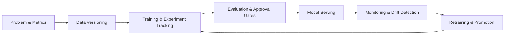

# MLOps Concepts Guide (Repository-Aligned)

This guide explains the core MLOps concepts used in this repository, how they map to the MLOps lifecycle, and where to find concrete implementations.

## What Is MLOps?

MLOps is the discipline of building, deploying, operating, and continuously improving machine learning systems using software engineering and platform engineering practices.

In this repository, MLOps is treated as a **closed feedback loop** rather than a one-time model release.

## The MLOps Cycle and Core Steps

The cycle below reflects how teams should work in this repo.

1. Define problem and success criteria
2. Collect and version data
3. Train and track experiments
4. Evaluate and approve models
5. Package and serve models
6. Observe production behavior
7. Trigger retraining and continuous improvement

Start with the end-to-end lifecycle walkthrough in [docs/golden-paths/mlops-workflow.md](docs/golden-paths/mlops-workflow.md).

---

## Step 1: Problem Definition and Success Metrics

### Concept
Before training, define target outcome, measurable metrics, and operational constraints (latency, cost, fairness, compliance).

### Why it matters
Without explicit targets, teams optimize training metrics but fail in production behavior.

### Example in this repo
- Quality and promotion criteria are encoded in policy and evaluation workflows.
- Approval policy and gate expectations: [policy/model-approval/README.md](policy/model-approval/README.md)
- CI evaluation gate: [ci/github-actions/model-evaluation/evaluate.yml](ci/github-actions/model-evaluation/evaluate.yml)

---

## Step 2: Data Versioning and Lineage

### Concept
Data versioning ensures the exact dataset used by a training run can be reproduced. Lineage links data, code, model artifact, and deployment state.

### Why it matters
If the dataset changes and is not versioned, model performance shifts cannot be audited.

### Example in this repo
- DVC remote/storage patterns: [dvc/remote-storage/](dvc/remote-storage/)
- DVC pipeline template: [dvc/pipeline-templates/train-eval-deploy.yaml](dvc/pipeline-templates/train-eval-deploy.yaml)
- Data versioning golden path: [docs/golden-paths/data-versioning.md](docs/golden-paths/data-versioning.md)
- Metadata lineage components: [mlflow/metadata-store/](mlflow/metadata-store/)

---

## Step 3: Training and Experiment Tracking

### Concept
Experiment tracking captures parameters, metrics, artifacts, and run metadata so model development is repeatable and comparable.

### Why it matters
You cannot reliably answer: "Which run produced production model vN and why was it promoted?"

### Example in this repo
- MLflow tracking stack: [mlflow/tracking-server/](mlflow/tracking-server/)
- Training workflow (CI): [ci/github-actions/model-training/train.yml](ci/github-actions/model-training/train.yml)
- Continuous training workflow: [ci/github-actions/model-training/continuous-training.yml](ci/github-actions/model-training/continuous-training.yml)
- Experiment tracking guide: [docs/golden-paths/experiment-tracking.md](docs/golden-paths/experiment-tracking.md)

---

## Step 4: Evaluation, Governance, and Approval Gates

### Concept
Evaluation verifies technical quality and policy compliance before release. Governance defines what evidence is required to promote a model.

### Why it matters
Promotion without gates increases production and compliance risk.

### Example in this repo
- Three-gate model approval process: [policy/model-approval/README.md](policy/model-approval/README.md)
- Data governance and classification: [policy/data-governance/README.md](policy/data-governance/README.md)
- PII checklist for model promotion: [policy/data-governance/pii-model-checklist.md](policy/data-governance/pii-model-checklist.md)
- Fairness policy definitions: [policy/fairness/](policy/fairness/)
- Evaluation CI workflow: [ci/github-actions/model-evaluation/evaluate.yml](ci/github-actions/model-evaluation/evaluate.yml)

---

## Step 5: Model Serving and Runtime Selection

### Concept
Serving is the process of exposing a trained model to consumers (online API or batch jobs) with reliability, scalability, and observability.

### Why it matters
A high-performing offline model is not useful unless it can be served safely in production.

### Serving modes in this repo
1. Online serving for low-latency predictions
2. Batch scoring for scheduled/high-throughput workloads

### Runtime strategy in this repo
- Triton for multi-framework/high-performance inference
- TorchServe for PyTorch-native workflows
- vLLM for LLM serving

### Example in this repo
- Runtime decision guide: [serving/README.md](serving/README.md)
- Triton configs: [serving/triton/](serving/triton/)
- TorchServe configs: [serving/torchserve/](serving/torchserve/)
- vLLM configs: [serving/vllm/](serving/vllm/)
- Serving golden path: [docs/golden-paths/model-serving.md](docs/golden-paths/model-serving.md)

---

## Step 6: Monitoring, Drift Detection, and SLOs

### Concept
Monitoring tracks model and system health in production, including data drift, quality regression, latency, and error rates.

### Why it matters
Model quality can degrade due to data distribution shifts even when infrastructure remains healthy.

### Types of monitoring in this repo
1. Data/model drift monitoring
2. Operational monitoring (alerts, dashboards, SLOs)
3. Fairness and quality monitoring

### Example in this repo
- Drift script: [monitoring/evidently/drift_report.py](monitoring/evidently/drift_report.py)
- Drift alerts: [monitoring/alerts/drift-alerts.yaml](monitoring/alerts/drift-alerts.yaml)
- Model health dashboard: [monitoring/dashboards/model-health.json](monitoring/dashboards/model-health.json)
- SLOs: [monitoring/slos/](monitoring/slos/)
- Monitoring guide: [docs/golden-paths/model-monitoring.md](docs/golden-paths/model-monitoring.md)

---

## Step 7: Retraining, Promotion, and Continuous Improvement

### Concept
When performance degrades or new data arrives, retraining pipelines produce new model candidates that go through the same evaluation and promotion gates.

### Why it matters
Continuous improvement keeps models relevant and reduces model staleness.

### Example in this repo
- Retraining pipeline: [pipelines/retraining_pipeline.py](pipelines/retraining_pipeline.py)
- Training pipeline: [pipelines/training_pipeline.py](pipelines/training_pipeline.py)
- Multi-environment promotion workflow: [ci/github-actions/promotion/](ci/github-actions/promotion/)
- Environment overlays for promotion: [cd/kubernetes/environments/](cd/kubernetes/environments/)
- Multi-env promotion guide: [docs/golden-paths/multi-env-promotion.md](docs/golden-paths/multi-env-promotion.md)

---

## Additional MLOps Concepts Used in This Repository

## CI/CD for ML (not just app CI)

### Concept
ML CI/CD validates model quality, data assumptions, and security posture in addition to code lint/tests.

### Example in this repo
- Shared ML security scan: [ci/github-actions/_shared/reusable-mlops-scan.yml](ci/github-actions/_shared/reusable-mlops-scan.yml)
- Deployment workflow: [ci/github-actions/model-deployment/deploy.yml](ci/github-actions/model-deployment/deploy.yml)

## Batch Inference

### Concept
Batch inference runs model scoring on a dataset at scheduled intervals, often with quality gates before downstream publishing.

### Example in this repo
- Batch scorer: [batch/runner/batch_scorer.py](batch/runner/batch_scorer.py)
- Input validator: [batch/runner/input_validator.py](batch/runner/input_validator.py)
- Output quality gate: [batch/runner/output_quality_gate.py](batch/runner/output_quality_gate.py)
- Downstream notifier: [batch/runner/downstream_notifier.py](batch/runner/downstream_notifier.py)
- Batch guide: [docs/golden-paths/batch-inference.md](docs/golden-paths/batch-inference.md)

## Pipeline Orchestration

### Concept
Orchestration coordinates multi-step ML workflows (train/eval/retrain) with dependencies and failure handling.

### Example in this repo
- Pipeline entrypoints: [pipelines/](pipelines/)
- Argo pipeline manifests: [cd/argo/pipelines/](cd/argo/pipelines/)
- Orchestration guide: [docs/golden-paths/pipeline-orchestration.md](docs/golden-paths/pipeline-orchestration.md)

## Fairness and Explainability

### Concept
Fairness evaluates model behavior across sensitive groups; explainability helps humans understand feature influence and prediction rationale.

### Example in this repo
- Fairness evaluation script: [fairness/evaluate.py](fairness/evaluate.py)
- Explainability script: [fairness/explainability.py](fairness/explainability.py)
- Fairness policies: [policy/fairness/](policy/fairness/)
- Guide: [docs/golden-paths/fairness-and-explainability.md](docs/golden-paths/fairness-and-explainability.md)

## Feature Store Patterns

### Concept
Feature stores standardize feature definitions and online/offline consistency for training and serving.

### Example in this repo
- Feast integration area: [feature-store/feast/](feature-store/feast/)
- Design guide: [docs/guides/feature-store-patterns.md](docs/guides/feature-store-patterns.md)

## FinOps for ML

### Concept
FinOps introduces cost visibility and budget controls at model/workload level.

### Example in this repo
- FinOps assets: [finops/](finops/)
- Cost dashboard artifact: [finops/dashboards/ml-cost-attribution.json](finops/dashboards/ml-cost-attribution.json)
- Guide: [docs/golden-paths/ml-cost-attribution.md](docs/golden-paths/ml-cost-attribution.md)

## Distributed Training

### Concept
Distributed training scales model training across multiple workers/GPUs for larger datasets and models.

### Example in this repo
- Distributed training assets: [training/](training/)
- Kubernetes training overlays: [cd/kubernetes/training/](cd/kubernetes/training/)
- Infrastructure support: [terraform/ray-cluster/](terraform/ray-cluster/)
- Guide: [docs/golden-paths/distributed-training.md](docs/golden-paths/distributed-training.md)

## Multi-cloud and Portability

### Concept
Portable MLOps designs avoid tight coupling to one cloud provider and make lifecycle patterns reusable across environments.

### Example in this repo
- Terraform targets: [terraform/aws-sagemaker/](terraform/aws-sagemaker/), [terraform/azure-ml/](terraform/azure-ml/), [terraform/gcp-vertex-ai/](terraform/gcp-vertex-ai/)
- Multi-cloud serving module: [multi_cloud_serving/](multi_cloud_serving/)

---

## Concept-to-File Quick Reference

| Concept | Primary files |
|---|---|
| Lifecycle overview | [docs/golden-paths/mlops-workflow.md](docs/golden-paths/mlops-workflow.md) |
| Experiment tracking | [mlflow/tracking-server/](mlflow/tracking-server/), [docs/golden-paths/experiment-tracking.md](docs/golden-paths/experiment-tracking.md) |
| Data versioning | [dvc/remote-storage/](dvc/remote-storage/), [docs/golden-paths/data-versioning.md](docs/golden-paths/data-versioning.md) |
| Model registry and approval | [policy/model-approval/README.md](policy/model-approval/README.md), [docs/golden-paths/model-registry.md](docs/golden-paths/model-registry.md) |
| Serving | [serving/README.md](serving/README.md), [docs/golden-paths/model-serving.md](docs/golden-paths/model-serving.md) |
| Monitoring | [monitoring/](monitoring/), [docs/golden-paths/model-monitoring.md](docs/golden-paths/model-monitoring.md) |
| Fairness & explainability | [fairness/](fairness/), [docs/golden-paths/fairness-and-explainability.md](docs/golden-paths/fairness-and-explainability.md) |
| Batch inference | [batch/](batch/), [docs/golden-paths/batch-inference.md](docs/golden-paths/batch-inference.md) |
| Pipeline orchestration | [pipelines/](pipelines/), [docs/golden-paths/pipeline-orchestration.md](docs/golden-paths/pipeline-orchestration.md) |
| FinOps | [finops/](finops/), [docs/golden-paths/ml-cost-attribution.md](docs/golden-paths/ml-cost-attribution.md) |
| Distributed training | [training/](training/), [docs/golden-paths/distributed-training.md](docs/golden-paths/distributed-training.md) |

---

## Suggested Reading Order

1. [GETTING_STARTED.md](GETTING_STARTED.md)
2. [docs/golden-paths/mlops-workflow.md](docs/golden-paths/mlops-workflow.md)
3. [docs/golden-paths/experiment-tracking.md](docs/golden-paths/experiment-tracking.md)
4. [docs/golden-paths/data-versioning.md](docs/golden-paths/data-versioning.md)
5. [docs/golden-paths/model-registry.md](docs/golden-paths/model-registry.md)
6. [docs/golden-paths/model-serving.md](docs/golden-paths/model-serving.md)
7. [docs/golden-paths/model-monitoring.md](docs/golden-paths/model-monitoring.md)
8. [docs/golden-paths/pipeline-orchestration.md](docs/golden-paths/pipeline-orchestration.md)

This sequence mirrors how teams typically progress from first experiment to production operations in this repository.
