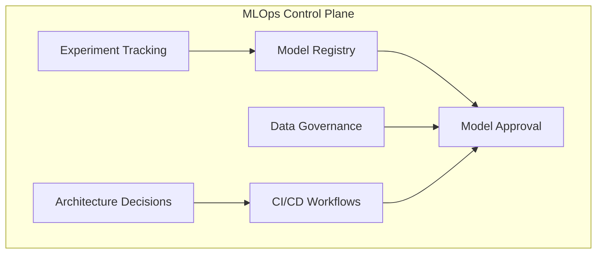
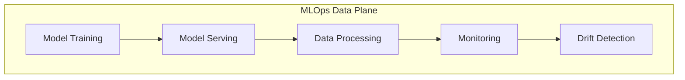
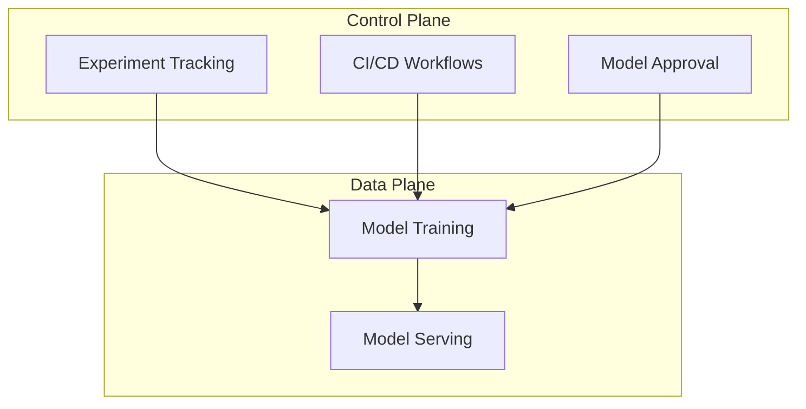
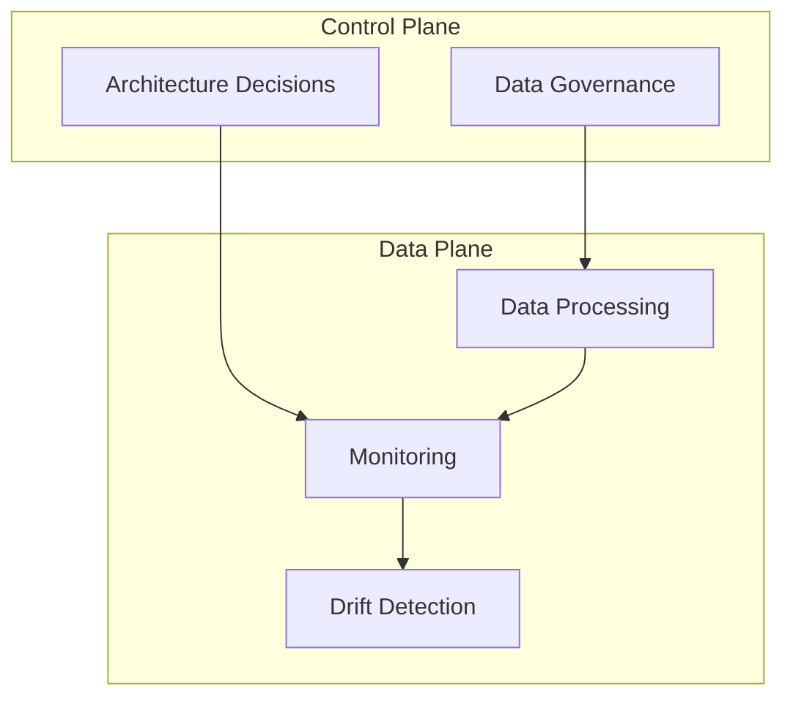

# MLOps Control Plane and Data Plane

---
**Owner**: @mlops-team
**Last Reviewed**: 2026-09-04
**Source of Truth**: docs/topology/INTEGRATION-BRIDGE.md
**Depends On**: external devops-playbook repository
---

## Control Plane Responsibilities

The MLOps control plane manages the governance, orchestration, and operational aspects of the ML lifecycle. It focuses on:

- **Experiment Tracking**: Managing experiment metadata, lineage, and tracking
- **Model Registry**: Managing model promotion, approval, and governance
- **Data Governance**: Managing data governance, policy enforcement, and governance
- **Architecture Decisions**: Managing architectural decisions and operational guidance
- **CI/CD Workflows**: Managing training, evaluation, and deployment workflows
- **Model Approval**: Managing model approval and promotion gates

### Control Plane Components

## Data Plane Responsibilities

The MLOps data plane focuses on the execution and processing aspects of the ML lifecycle. It focuses on:

- **Model Training**: Executing distributed training and evaluation
- **Model Serving**: Executing model serving and inference
- **Data Processing**: Executing data processing and feature store operations
- **Monitoring**: Executing monitoring and FinOps operations
- **Drift Detection**: Executing drift detection and performance metrics

### Data Plane Components

## Control Plane vs Data Plane Boundaries

### Governance Layer

The control plane implements governance and orchestration:

- **Experiment Tracking**: MLflow-based experiment tracking and model lineage
- **Model Registry**: Model promotion and approval gates
- **Data Governance**: Classification levels, PII handling, and retention rules
- **Architecture Decisions**: Decision records and operational guidance
- **CI/CD Workflows**: Training, evaluation, and deployment workflows
- **Model Approval**: Three-gate CI evaluation and approval process

### Execution Layer

The data plane focuses on execution and processing:

- **Model Training**: Distributed training and evaluation
- **Model Serving**: Production-ready serving patterns
- **Data Processing**: Data processing and feature store operations
- **Monitoring**: Drift detection and performance metrics
- **Drift Detection**: Evidently-based monitoring and Prometheus integration

## Control Plane Architecture

### Experiment Tracking Component

**Purpose**: Manage experiment metadata, lineage, and tracking

**Key Features**:
- Experiment tracking and model lineage
- Metadata management and artifact storage
- Experiment comparison and analysis

**Configuration**:
- `mlflow/tracking-server/` - Tracking server configuration
- `mlflow/metadata-store/` - Metadata store configuration
- `mlflow/model-registry/` - Model registry configuration

### Model Registry Component

**Purpose**: Manage model promotion and approval

**Key Features**:
- Model promotion and approval gates
- Three-gate CI evaluation process
- Model version management and governance

**Configuration**:
- `policy/model-approval/` - Model approval governance
- `mlflow/model-registry/` - Model registry implementation

### Data Governance Component

**Purpose**: Manage data governance and policy enforcement

**Key Features**:
- Classification levels and governance
- PII handling and retention rules
- Fairness and explainability patterns

**Configuration**:
- `policy/data-governance/` - Data governance controls
- `fairness/` - Fairness and explainability

### Architecture Decisions Component

**Purpose**: Manage architectural decisions and operational guidance

**Key Features**:
- Architecture Decision Records
- Operational guidance and best practices
- Golden paths and implementation patterns

**Configuration**:
- `docs/decisions/` - Architecture Decision Records
- `docs/golden-paths/` - Golden paths and guides
- `docs/guides/` - Operational guidance

### CI/CD Workflows Component

**Purpose**: Manage training, evaluation, and deployment workflows

**Key Features**:
- Training, evaluation, and deployment workflows
- Production workflow orchestration
- Cloud infrastructure provisioning

**Configuration**:
- `ci/github-actions/` - CI workflow templates
- `cd/argo/pipelines/` - CD workflow DAGs
- `terraform/` - Cloud-specific infrastructure

### Model Approval Component

**Purpose**: Manage model approval and promotion gates

**Key Features**:
- Three-gate CI evaluation process
- Model promotion and approval gates
- Model governance enforcement

**Configuration**:
- `policy/model-approval/` - Model approval governance
- `policy/model-approval/approved-versions.yaml`
- `policy/model-approval/gates.yaml`

## Data Plane Architecture

### Model Training Component

**Purpose**: Execute distributed training and evaluation

**Key Features**:
- Distributed training patterns
- Checkpoint management
- Resource allocation and workload scheduling

**Configuration**:
- `training/` - Distributed training scripts
- `cd/kubernetes/training/` - Kubernetes training manifests
- `terraform/ray-cluster/` - Ray cluster configuration

### Model Serving Component

**Purpose**: Execute model serving and inference

**Key Features**:
- Production-ready serving patterns
- Multi-cloud serving and routing
- Batch inference and online serving

**Configuration**:
- `serving/torchserve/` - TorchServe serving patterns
- `serving/triton/` - Triton serving patterns
- `serving/vllm/` - vLLM serving patterns
- `cd/kubernetes/_base/` - Base Kubernetes manifests

### Data Processing Component

**Purpose**: Execute data processing and feature store operations

**Key Features**:
- Data processing and feature store operations
- Data versioning and remote storage
- Pipeline templates and workflow orchestration

**Configuration**:
- `dvc/` - Data versioning and pipeline templates
- `feature-store/` - Feature store patterns
- `pipelines/` - Pipeline runners and components

### Monitoring Component

**Purpose**: Execute monitoring and FinOps operations

**Key Features**:
- Drift detection and performance metrics
- Monitoring and alerting infrastructure
- Cost attribution and budget controls

**Configuration**:
- `monitoring/evidently/` - Drift detection and metrics
- `monitoring/alerts/` - Alert rules and configurations
- `monitoring/dashboards/` - Operational dashboards
- `finops/` - Cost attribution and budget controls

### Drift Detection Component

**Purpose**: Execute drift detection and performance metrics

**Key Features**:
- Evidently-based monitoring
- Prometheus integration
- Performance metrics and dashboards

**Configuration**:
- `monitoring/evidently/` - Drift detection and metrics
- `monitoring/alerts/` - Alert rules and configurations
- `monitoring/dashboards/` - Operational dashboards

## Control Plane Data Plane Interactions

### Training Workflow

### Monitoring Workflow

## Control Plane Governance

### Governance Principles

1. **Deliberate Governance**: Control plane implements deliberate governance and orchestration
2. **Explicit Contracts**: Control plane implements explicit contracts and governance
3. **Enforceable Interface**: Control plane implements enforceable interface and governance enforcement
4. **Clear Boundaries**: Control plane implements clear boundaries and governance enforcement

### Governance Enforcement

The control plane implements governance enforcement through:

- **CI/CD Workflows**: CI checks and governance enforcement
- **Model Approval**: Three-gate CI evaluation and governance enforcement
- **Data Governance**: Policy enforcement and governance enforcement
- **Architecture Decisions**: Decision records and governance enforcement

## Data Plane Execution

### Execution Principles

1. **Direct Execution**: Data plane focuses on direct execution and processing
2. **Performance Focus**: Data plane focuses on performance and execution
3. **Resource Allocation**: Data plane focuses on resource allocation and workload scheduling
4. **Monitoring Integration**: Data plane focuses on monitoring integration and performance

### Execution Patterns

The data plane implements execution patterns through:

- **Model Training**: Distributed training and evaluation patterns
- **Model Serving**: Production-ready serving patterns
- **Data Processing**: Data processing and feature store patterns
- **Monitoring**: Drift detection and performance patterns
- **Drift Detection**: Evidently-based monitoring patterns

## Integration with Platform

### Platform Primitives in Control Plane

The control plane depends on platform primitives for governance and orchestration:

- **Secrets Management**: Secrets management and credential handling
- **Policy Controls**: Policy enforcement and governance
- **Observability Baseline**: Monitoring and alerting infrastructure

### Platform Primitives in Data Plane

The data plane depends on platform primitives for execution and processing:

- **GPU Cluster**: GPU provisioning and workload scheduling
- **Base Kubernetes**: Base Kubernetes primitives and manifests

## Control Plane vs Data Plane Summary

### Control Plane Focus

- **Governance**: Governance and orchestration
- **Management**: Management and governance enforcement
- **Decision**: Decision and governance enforcement
- **Workflow**: Workflow and governance enforcement

### Data Plane Focus

- **Execution**: Execution and processing
- **Performance**: Performance and execution
- **Resource**: Resource allocation and workload scheduling
- **Monitoring**: Monitoring integration and performance

## Related Resources

- [Integration Bridge](INTEGRATION-BRIDGE.md) - Repository responsibility map and integration contract
- [Dependency Matrix](DEPENDENCY-MATRIX.md) - Executable dependency matrix
- [Architecture Decision Guide](ARCHITECTURE_DECISION_GUIDE.md) - Architectural decisions and patterns
- [Golden Paths](docs/golden-paths/) - End-to-end workflows and implementation guides
- [CI Workflows](ci/github-actions/) - Training, evaluation, and deployment workflows
- [CD Workflows](cd/argo/pipelines/) - Production workflow DAGs
- [Infrastructure](terraform/) - Cloud-specific ML infrastructure starter configurations
