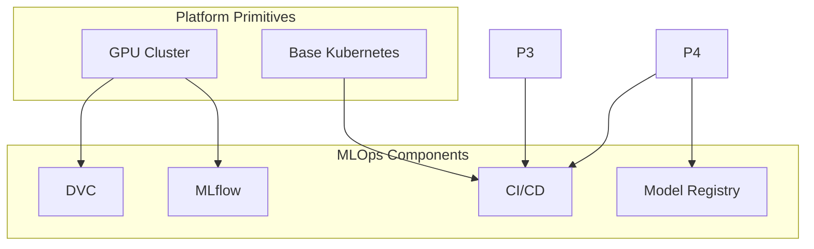
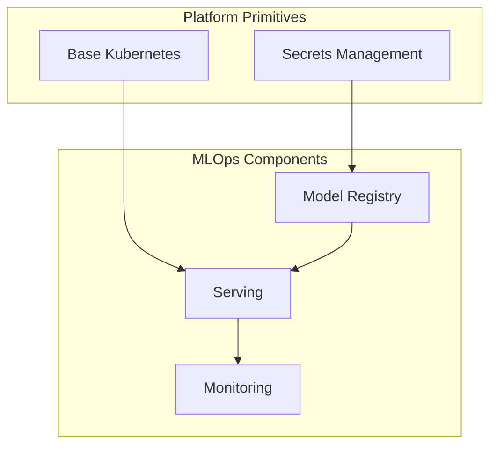
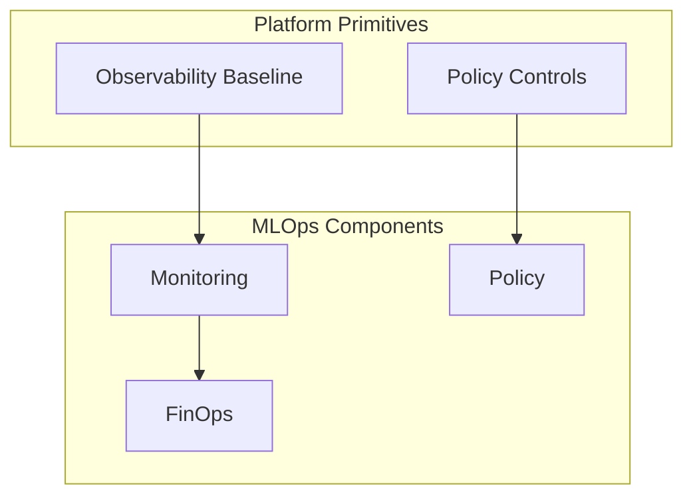

# Executable Dependency Matrix

---
**Owner**: @mlops-team
**Last Reviewed**: 2026-09-04
**Source of Truth**: docs/topology/INTEGRATION-BRIDGE.md
**Depends On**: external devops-playbook repository
---

## Platform Primitives Dependencies

This matrix documents the executable dependencies between the MLOps repository and the platform repository.

### Required Platform Primitives

| Primitive | Version | Configuration Input | Purpose | Usage in MLOps |
|---------|--------|-------------------|---------|---------------|
| GPU Cluster | v1.2.0 | `cluster-config.yaml` | GPU provisioning and workload scheduling | Training, distributed training, batch inference |
| Base Kubernetes | v1.28.0 | `k8s-base.yaml` | Base Kubernetes primitives and manifests | Model serving, deployment, CI/CD |
| Secrets Management | v1.0.0 | `secrets-config.yaml` | Secrets management and credential handling | Model registry, serving, monitoring |
| OIDC Federation | v1.1.0 | `oidc-config.yaml` | Identity federation and authentication | CI/CD workflows, model promotion |
| Policy Controls | v1.0.0 | `policy-config.yaml` | Policy enforcement and governance | Model approval, data governance, fairness |
| Observability Baseline | v1.0.0 | `observability-config.yaml` | Monitoring and alerting infrastructure | Monitoring, FinOps, drift detection |

### MLOps Components Dependencies

#### MLflow Component

**Dependencies**:
- **Platform**: Secrets Management (v1.0.0)
- **Platform**: Observability Baseline (v1.0.0)

**Configuration Inputs**:
- `mlflow/tracking-server/docker-compose.yml` - Tracking server configuration
- `mlflow/metadata-store/docker-compose.yml` - Metadata store configuration
- `mlflow/model-registry/docker-compose.yml` - Model registry configuration

**Usage**:
- Experiment tracking and model lineage
- Model registry promotion and approval gates
- Metadata management and artifact storage

#### DVC Component

**Dependencies**:
- **Platform**: None (standalone)

**Configuration Inputs**:
- `dvc/pipeline-templates/train-eval-deploy.yaml` - Training pipeline template
- `dvc/pipeline-templates/eval-deploy.yaml` - Evaluation pipeline template
- `dvc/remote-storage/` - Remote storage configuration

**Usage**:
- Data versioning and remote storage
- Pipeline templates and workflow orchestration
- Data governance and lineage

#### Model Registry Component

**Dependencies**:
- **Platform**: Secrets Management (v1.0.0)
- **Platform**: Policy Controls (v1.0.0)

**Configuration Inputs**:
- `policy/model-approval/approved-versions.yaml` - Approved versions configuration
- `policy/model-approval/gates.yaml` - Approval gates configuration
- `mlflow/model-registry/` - Model registry implementation

**Usage**:
- Model promotion and approval gates
- Three-gate CI evaluation process
- Model version management and governance

#### Serving Component

**Dependencies**:
- **Platform**: Base Kubernetes (v1.28.0)
- **Platform**: Secrets Management (v1.0.0)

**Configuration Inputs**:
- `serving/torchserve/` - TorchServe serving patterns
- `serving/triton/` - Triton serving patterns
- `serving/vllm/` - vLLM serving patterns
- `cd/kubernetes/_base/` - Base Kubernetes manifests

**Usage**:
- Model serving and inference patterns
- Production-ready serving stacks
- Multi-cloud serving and routing

#### Monitoring Component

**Dependencies**:
- **Platform**: Observability Baseline (v1.0.0)
- **Platform**: Policy Controls (v1.0.0)

**Configuration Inputs**:
- `monitoring/evidently/` - Drift detection and metrics
- `monitoring/alerts/` - Alert rules and configurations
- `monitoring/dashboards/` - Operational dashboards
- `finops/` - Cost attribution and budget controls

**Usage**:
- Drift detection and performance metrics
- Monitoring and alerting infrastructure
- FinOps and cost governance

#### Policy Component

**Dependencies**:
- **Platform**: Policy Controls (v1.0.0)

**Configuration Inputs**:
- `policy/model-approval/` - Model approval governance
- `policy/data-governance/` - Data governance controls
- `fairness/` - Fairness and explainability

**Usage**:
- Model approval and governance enforcement
- Data governance and policy enforcement
- Fairness and explainability patterns

#### CI/CD Component

**Dependencies**:
- **Platform**: GPU Cluster (v1.2.0)
- **Platform**: Base Kubernetes (v1.28.0)
- **Platform**: Secrets Management (v1.0.0)
- **Platform**: OIDC Federation (v1.1.0)
- **Platform**: Observability Baseline (v1.0.0)

**Configuration Inputs**:
- `ci/github-actions/` - CI workflow templates
- `cd/argo/pipelines/` - CD workflow DAGs
- `terraform/` - Cloud-specific infrastructure

**Usage**:
- Training, evaluation, and deployment workflows
- Production workflow orchestration
- Cloud infrastructure provisioning

#### Architecture Decisions Component

**Dependencies**:
- **Platform**: None (standalone)

**Configuration Inputs**:
- `docs/decisions/` - Architecture Decision Records
- `docs/golden-paths/` - Golden paths and guides
- `docs/guides/` - Operational guidance and patterns

**Usage**:
- Architecture decision documentation
- Operational guidance and best practices
- Golden paths and implementation patterns

## Dependency Execution Flow

### Training Workflow



### Serving Workflow



### Monitoring Workflow



## Configuration Input Details

### GPU Cluster Configuration

```yaml
# cluster-config.yaml
gpu-cluster:
  version: "v1.2.0"
  provider: "kubernetes"
  resources:
    gpu:
      type: "nvidia"
      count: 4
      memory: "32GB"
    cpu:
      type: "kubernetes"
      count: 8
    storage:
      type: "pvc"
      size: "100Gi"
```

### Base Kubernetes Configuration

```yaml
# k8s-base.yaml
base-kubernetes:
  version: "v1.28.0"
  provider: "kubernetes"
  resources:
    api:
      version: "v1.28"
    admission:
      version: "v1.28"
    runtime:
      version: "v1.28"
    storage:
      version: "v1.28"
```

### Secrets Management Configuration

```yaml
# secrets-config.yaml
secrets-management:
  version: "v1.0.0"
  provider: "kubernetes"
  resources:
    secrets:
      type: "kubernetes"
      scope: "namespace"
    configmaps:
      type: "kubernetes"
      scope: "namespace"
```

### OIDC Federation Configuration

```yaml
# oidc-config.yaml
oidc-federation:
  version: "v1.1.0"
  provider: "kubernetes"
  resources:
    oidc:
      type: "kubernetes"
      scope: "cluster"
    authentication:
      type: "kubernetes"
      scope: "cluster"
```

### Policy Controls Configuration

```yaml
# policy-config.yaml
policy-controls:
  version: "v1.0.0"
  provider: "kubernetes"
  resources:
    policies:
      type: "kubernetes"
      scope: "namespace"
    admission:
      type: "kubernetes"
      scope: "namespace"
    governance:
      type: "kubernetes"
      scope: "cluster"
```

### Observability Baseline Configuration

```yaml
# observability-config.yaml
observability-baseline:
  version: "v1.0.0"
  provider: "kubernetes"
  resources:
    monitoring:
      type: "kubernetes"
      scope: "cluster"
    alerting:
      type: "kubernetes"
      scope: "cluster"
    dashboards:
      type: "kubernetes"
      scope: "namespace"
```

## Dependency Validation

### CI Check for Dependencies

```yaml
# .github/workflows/dependency-validation.yml
name: Dependency Validation

on:
  schedule:
    - cron: '0 0 1 * *'  # Monthly
  pull_request:
    branches: [main, develop]

jobs:
  validate-dependencies:
    runs-on: ubuntu-latest
    steps:
      - uses: actions/checkout@v4
      
      - name: Check platform primitives exist
        run: |
          # Verify all required platform primitives exist
          required_primitives=(
            "cicd-reference/cluster-config.yaml"
            "cicd-reference/k8s-base.yaml"
            "cicd-reference/secrets-config.yaml"
            "cicd-reference/oidc-config.yaml"
            "cicd-reference/policy-config.yaml"
            "cicd-reference/observability-config.yaml"
          )
          
          for primitive in "${required_primitives[@]}"; do
            if [ ! -f "$primitive" ]; then
              echo "❌ Missing platform primitive: $primitive"
              exit 1
            fi
          done
      
      - name: Validate platform versions
        run: |
          # Check platform version compatibility
          platform_version=$(cat cicd-reference/manifest.yaml | grep version)
          min_version=$(cat .cicd-reference/manifest.yaml | grep min-platform-version)
          
          if [ "$platform_version" < "$min_version" ]; then
            echo "❌ Platform version $platform_version is incompatible"
            exit 1
          fi
      
      - name: Check required features
        run: |
          # Verify all required features are present
          required_features=$(cat .cicd-reference/manifest.yaml | grep required-features)
          
          for feature in $required_features; do
            if [ ! -f "$feature" ]; then
              echo "❌ Missing required feature: $feature"
              exit 1
            fi
          done
```

## Dependency Management

### Updating Dependencies

When updating platform primitives:

1. **Review Platform Version**: Check platform version compatibility
2. **Update Configuration**: Update configuration inputs for affected components
3. **Run CI Checks**: Validate all dependency checks pass
4. **Update Documentation**: Update dependency matrix and integration bridge
5. **Test Workflows**: Test affected workflows with new dependencies

### Dependency Rollback

If platform primitive update causes issues:

1. **Rollback Platform**: Rollback platform primitive to previous version
2. **Update Configuration**: Update configuration inputs to previous version
3. **Run CI Checks**: Validate all dependency checks pass
4. **Test Workflows**: Test affected workflows with rolled-back dependencies

## Related Resources

- [Integration Bridge](INTEGRATION-BRIDGE.md) - Repository responsibility map and integration contract
- [Architecture Decision Guide](ARCHITECTURE_DECISION_GUIDE.md) - Architectural decisions and patterns
- [Golden Paths](docs/golden-paths/) - End-to-end workflows and implementation guides
- [CI Workflows](ci/github-actions/) - Training, evaluation, and deployment workflows
- [CD Workflows](cd/argo/pipelines/) - Production workflow DAGs
- [Infrastructure](terraform/) - Cloud-specific ML infrastructure starter configurations
