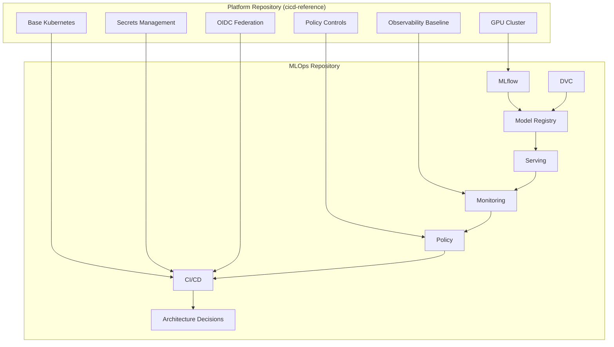

# Integration Bridge

---
**Owner**: @mlops-team
**Last Reviewed**: 2026-09-04
**Source of Truth**: docs/ARCHITECTURE_DECISION_GUIDE.md
**Depends On**: external devops-playbook repository
---

## Repository Responsibility Map

### Platform Repository (`cicd-reference`)

**Responsibilities**:
- GPU cluster provisioning and management
- Base Kubernetes primitives and infrastructure
- Secrets management and OIDC federation
- Policy controls and observability baseline
- Shared CI/CD templates and infrastructure patterns

**Key Components**:
- `.cicd-reference/` - Platform primitives and infrastructure
- `.cicd-reference/cluster/` - GPU cluster provisioning
- `.cicd-reference/k8s/` - Base Kubernetes primitives
- `.cicd-reference/secrets/` - Secrets management
- `.cicd-reference/policy/` - Policy controls
- `.cicd-reference/observability/` - Observability baseline

### MLOps Repository (This Repository)

**Responsibilities**:
- Experiment tracking and model lineage with MLflow
- Data and artifact versioning with DVC
- Model registry promotion and approval gates
- Model serving patterns (Triton, TorchServe, vLLM)
- Model drift monitoring and performance metrics
- Model approval policy enforcement
- Data governance policy enforcement
- Architecture Decision Records and operational guidance

**Key Components**:
- `mlflow/` - Experiment tracking and model registry
- `dvc/` - Data versioning and pipeline templates
- `serving/` - Runtime serving stacks
- `monitoring/` - Drift detection and metrics
- `policy/` - Model approval and data governance
- `docs/` - Golden paths, guides, and decisions
- `ci/` - CI workflow templates
- `cd/` - CD workflow templates
- `terraform/` - Cloud-specific infrastructure

## Integration Contract

### Platform Primitives Required

The MLOps repository depends on the following platform primitives:

| Primitive | Version | Configuration Input | Purpose |
|---------|--------|-------------------|---------|
| GPU Cluster | v1.2.0 | `cluster-config.yaml` | GPU provisioning and workload scheduling |
| Base Kubernetes | v1.28.0 | `k8s-base.yaml` | Base Kubernetes primitives and manifests |
| Secrets Management | v1.0.0 | `secrets-config.yaml` | Secrets management and credential handling |
| OIDC Federation | v1.1.0 | `oidc-config.yaml` | Identity federation and authentication |
| Policy Controls | v1.0.0 | `policy-config.yaml` | Policy enforcement and governance |
| Observability Baseline | v1.0.0 | `observability-config.yaml` | Monitoring and alerting infrastructure |

### MLOps Workflows

The MLOps repository implements the following ML lifecycle workflows:

1. **Experiment Tracking**: MLflow-based experiment tracking and model lineage
2. **Data Versioning**: DVC-based data versioning and remote storage
3. **Model Registry**: Model promotion and approval gates
4. **Model Serving**: Production-ready serving patterns (Triton, TorchServe, vLLM)
5. **Model Monitoring**: Drift detection and performance metrics
6. **Model Approval**: Three-gate CI evaluation and approval process
7. **Data Governance**: Classification levels, PII handling, and retention rules
8. **Architecture Decisions**: Decision records and operational guidance

## Control Plane vs Data Plane

### Control Plane Responsibilities

**Platform Control Plane**:
- Infrastructure provisioning and management
- Resource allocation and workload scheduling
- Security and governance enforcement
- Observability and alerting infrastructure

**MLOps Control Plane**:
- Experiment tracking and model registry management
- Data governance and policy enforcement
- Model approval and promotion workflows
- Architecture decision management

### Data Plane Responsibilities

**Platform Data Plane**:
- GPU cluster execution and workload processing
- Kubernetes workload execution
- Shared infrastructure execution

**MLOps Data Plane**:
- Model training and evaluation
- Model serving and inference
- Data processing and feature store operations
- Monitoring and FinOps operations

## Integration Diagram



## Compatibility Contract

### Platform Manifest Requirements

The MLOps repository requires the platform repository to publish the following manifest:

```yaml
# Platform Manifest (cicd-reference/manifest.yaml)
platform:
  version: "1.2.0"
  components:
    gpu-cluster:
      version: "v1.2.0"
      required: true
    base-kubernetes:
      version: "v1.28.0"
      required: true
    secrets-management:
      version: "v1.0.0"
      required: true
    oidc-federation:
      version: "v1.1.0"
      required: true
    policy-controls:
      version: "v1.0.0"
      required: true
    observability-baseline:
      version: "v1.0.0"
      required: true

compatibility:
  min-platform-version: "1.2.0"
  max-platform-version: "1.3.0"
  required-features:
    - gpu-provisioning
    - k8s-primitives
    - secrets-handling
    - oidc-auth
    - policy-enforcement
    - observability-baseline
```

### CI Check for Platform Manifest

The repository includes a CI check to validate platform manifest compatibility:

```yaml
# .github/workflows/platform-compatibility.yml
name: Platform Compatibility Check

on:
  schedule:
    - cron: '0 0 1 * *'  # Monthly
  pull_request:
    branches: [main, develop]

jobs:
  check-platform-manifest:
    runs-on: ubuntu-latest
    steps:
      - uses: actions/checkout@v4
      
      - name: Download platform manifest
        run: |
          # Download platform manifest from cicd-reference
          git clone https://github.com/platform/cicd-reference.git
          
      - name: Validate platform version
        run: |
          # Check platform version compatibility
          platform_version=$(cat cicd-reference/manifest.yaml | grep version)
          min_version=$(cat .cicd-reference/manifest.yaml | grep min-platform-version)
          
          if [ "$platform_version" < "$min_version" ]; then
            echo "❌ Platform version $platform_version is incompatible"
            exit 1
          fi
      
      - name: Check required features
        run: |
          # Verify all required features are present
          required_features=$(cat .cicd-reference/manifest.yaml | grep required-features)
          
          for feature in $required_features; do
            if [ ! -f "$feature" ]; then
              echo "❌ Missing required feature: $feature"
              exit 1
            fi
          done
```

## Integration Best Practices

### 1. Deliberate Dependency

- Document all platform dependencies explicitly
- Maintain clear ownership boundaries
- Create explicit integration contracts

### 2. Enforceable Interface

- Turn "not islands" from a principle into an enforceable interface
- Use CI checks to validate integration contract
- Automate compatibility validation

### 3. Regular Updates

- Review integration contract on every structural PR
- Run monthly compatibility checks
- Update platform manifest as needed

### 4. Clear Documentation

- Maintain up-to-date integration bridge documentation
- Document all platform primitives and versions
- Keep configuration inputs documented

## Related Resources

- [Architecture Decision Guide](ARCHITECTURE_DECISION_GUIDE.md) - Architectural decisions and patterns
- [Golden Paths](docs/golden-paths/) - End-to-end workflows and implementation guides
- [CI Workflows](ci/github-actions/) - Training, evaluation, and deployment workflows
- [CD Workflows](cd/argo/pipelines/) - Production workflow DAGs
- [Infrastructure](terraform/) - Cloud-specific ML infrastructure starter configurations
